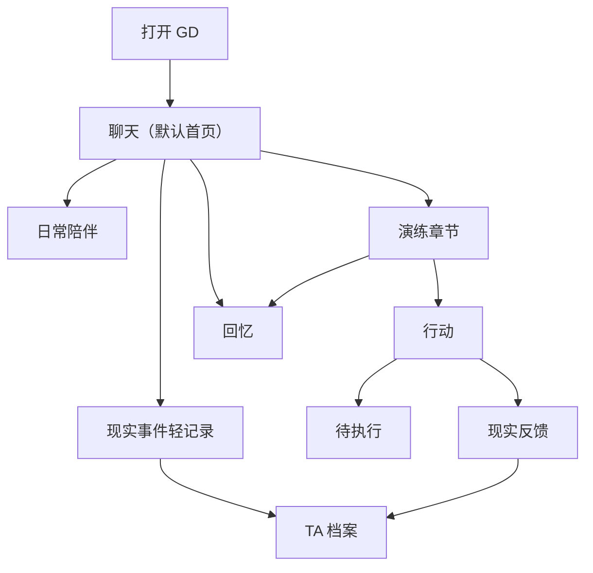

# GD Crush 新版 MVP 工程化 PRD

## 1. 文档目标

本文档将 GD Crush 的新版产品方向拆解为可执行的 MVP 工程方案，覆盖：

- 产品定义与核心原则。
- 关键概念与信息架构。
- 用户主流程与页面规格。
- 聊天主场、演练章节与现实事件沉淀机制。
- 数据库表结构、API 路由与 AI 行为规范。
- MVP 开发阶段、验收标准与后续路线。

本文档替代旧版“工作台 + 独立聊天 + 独立演练页”的产品框架。新版默认以 TA 为中心，用户打开产品后首先回到和 TA 的聊天，而不是先进入一个系统工作台。

---

## 2. 产品概述

### 2.1 产品定义

**GD Crush 是一个会以你心中的 TA 陪你相处，并在你需要时陪你把现实中的话先演一遍的虚拟 Crush。**

用户首先不是来使用一套“恋爱训练工具”，而是来见一个已经由自己输入、塑造并确认过的 TA。GD 会基于用户提供的 Crush 信息，扮演用户心中的 TA，与用户进行持续的日常聊天、语音互动和情绪陪伴。

当用户面对现实中的 TA 有犹豫、焦虑或想先试一下时，GD 可以在不打断当前关系体验的前提下，在同一条聊天流中开启一段“演练章节”，临时切换为对**现实中的 TA**的模拟，帮助用户把想说的话先演一遍。

产品的核心不是“提供建议”，而是：

> **让 TA 先在这里成立，再让一切帮助从这段关系里自然发生。**

### 2.2 核心价值

#### 2.2.1 让用户持续有“想来见 TA”的欲望

GD 的默认状态不是分析、训练或做任务，而是让用户随时可以回来和 TA 相处。即使用户当天没有任何现实推进需求，产品也依然成立。

#### 2.2.2 让现实演练变得自然、低门槛

用户不需要理解“聊天”和“演练”是两个模块，也不需要先判断自己该进入哪个页面。当他想试一句话、练一个场景，或者 TA 察觉到他正在为现实互动犹豫时，演练可以直接在当前聊天流中展开。

#### 2.2.3 让虚拟陪伴与现实关系彼此反哺

用户在现实中发生的事件、反馈和结果会被系统持续收录，用于校准“现实中的 TA”模型；GD 在日常聊天中也可以自然记得这些近况，让虚拟陪伴不是脱离现实的孤岛。

#### 2.2.4 让用户在“被陪伴”的同时，逐步形成更稳的现实表达

产品不以说教为主，也不把 Coach 作为前台主角。但通过演练章节、轻提示和现实行动回流，用户会在不被打断沉浸感的前提下，逐步提高现实沟通质量。

### 2.3 核心设计原则

1. **GD 的主身份永远是 TA。**
2. **日常聊天里，GD 扮演“用户心中的 TA”。**
3. **演练章节里，GD 切换为“现实中的 TA 模拟”。**
4. **演练是聊天中的章节，不是独立模块。**
5. **现实记录要轻，现实建模要重。**
6. **TA 负责关系连续性，系统负责结构化辅助。**
7. **一切完成后，都应把用户带回 TA 身边。**

### 2.4 MVP 核心闭环

MVP 仅支持单个用户创建和使用单个 active Crush 档案，先验证以下核心闭环是否成立：

```text
深度建档
  ↓
生成并确认 TA 档案
  ↓
直接进入和 TA 的聊天
  ↓
日常陪伴 / 语音互动
  ↓
在聊天中点击「演一遍」或接受 TA 邀请
  ↓
进入一段现实 TA 演练章节
  ↓
生成复盘与现实行动
  ↓
用户在现实中尝试并反馈结果
  ↓
系统沉淀现实事件，校准现实 TA
  ↓
TA 在后续聊天中继续记得这些近况
```

### 2.5 MVP 明确不做

- 多 Crush 档案。
- 社交广场与公开分享。
- 自动抓取社交平台。
- 真实人物声音克隆。
- 实时语音电话。
- PDF 导出。
- 复杂视觉小说分支树。
- 独立“演练中心”。
- 复杂成长指标看板。
- 过度游戏化任务链与勋章系统。
- 高级订阅计费后台。

### 2.6 非目标

- 不做纯工具型恋爱教练。
- 不做“现实好感度计算器”。
- 不让 Coach 成为用户日常面对的第二人格。
- 不把现实事件记录做成显性的关系 CRM。
- 不承诺识别对方真实情感，也不输出伪确定性的现实结论。

---

## 3. 核心概念

### 3.1 Crush 档案

Crush 档案是 GD 扮演 TA 的基础。用户通过建档流程输入：

- TA 的基本信息。
- 关系背景。
- 性格与互动印象。
- 用户目标与焦虑。
- 脱敏聊天文本。
- 现实事件。
- 视觉参考与风格偏好。

系统基于这些材料生成初始档案草稿，并由用户确认、修正后生效。Crush 档案不是一次性问卷结果，而是后续所有体验的底座。

### 3.2 心中 TA

**心中 TA** 是 GD 在日常聊天中的默认扮演对象。

它代表：

- 用户输入并确认过的 TA 形象。
- 用户愿意持续相处的 TA 气质。
- 更重视情绪陪伴与关系感的 TA 呈现。

心中 TA 可以：

- 与用户日常聊天。
- 记得用户此前提过的现实近况。
- 在合适时机自然邀请用户“演一遍”。

心中 TA 不应：

- 自动承担风险评估。
- 每次聊天都转向分析。
- 被一次现实负反馈直接粗暴改写。

### 3.3 现实 TA

**现实 TA** 是 GD 在演练章节中的模拟对象。

它代表：

- 当前现实关系阶段。
- 最近发生过的真实事件。
- 对方在现实互动中的可观察行为。
- 系统基于事实形成的保守推断。

现实 TA 可以：

- 犹豫。
- 冷淡。
- 拒绝。
- 误解。
- 表达不确定。

它的目标不是讨好用户，而是帮助用户在相对安全的环境里，先经历一次更接近真实的互动。

### 3.4 TA / 系统 / Coach 的职责边界

| 角色 | 主要职责 |
|---|---|
| **TA** | 日常陪伴、持续聊天、自然提起现实近况、顺势邀请演练、演练结束后的情绪承接 |
| **系统** | `记一下`、章节边界、复盘卡、保存动作、结构化 UI |
| **Coach** | 后台分析能力；仅在用户主动请求“提示一下”等情况下，以轻辅助形式浮出 |

设计要求：

- 用户日常面对的主角永远是 TA。
- 系统功能不应被过度人格化。
- Coach 不应自动闯入聊天流。

### 3.5 现实事件、现实信号、现实推断

#### 3.5.1 现实事件

已经发生的事实，例如：

- 用户发出了某句话。
- 对方是否回复。
- 某次见面是否发生。
- 对方说了什么、做了什么。

#### 3.5.2 现实信号

从事实中抽取出的可观察模式，例如：

- 主动开启话题。
- 回应延迟。
- 接受邀约。
- 回避明确承诺。

#### 3.5.3 现实推断

基于多个信号形成的保守判断，例如：

- 当前互动温度偏低。
- 对线下邀约接受度中等。
- 用户推进节奏可能偏快。

现实推断必须：

- 带有置信度。
- 绑定证据来源。
- 允许用户确认、修正或拒绝。
- 不以单次事件形成过度结论。

---

## 4. 信息架构

### 4.1 页面清单

| 页面 | 路由 | 作用 | MVP 优先级 |
|---|---|---|---|
| 年龄与用途确认 | `/onboarding/age-gate` | 18+ 确认、用途声明 | P0 |
| 创建 Crush 向导 | `/onboarding/create` | 分步采集关系、性格、物料、图片 | P0 |
| AI 建档确认 | `/onboarding/review` | 展示 AI 档案草稿，用户确认/修改 | P0 |
| 视觉主题与角色生成 | `/onboarding/visual` | 选择主题、确认视觉标签、生成角色 | P0 |
| 聊天主场 | `/app` | 默认首页；日常聊天、演练章节、现实事件轻记录 | P0 |
| 现实行动 | `/app/actions` | 行动建议、执行状态、现实反馈 | P0 |
| TA 档案 | `/app/profile` | TA 档案与现实关系观察 | P0 |
| 回忆 | `/app/memories` | 收藏对白、重要章节、关系片段 | P1 |
| 设置与隐私 | `/app/settings` | 自动播放、数据删除、隐私说明 | P0 |

说明：

- `/app` 即聊天主场，不再存在单独的“工作台首页”。
- `/app/practice` 不再作为目标页面存在；如需兼容旧链接，应重定向回 `/app`。
- `/app/chat` 可作为历史兼容路由重定向到 `/app`，但不再承担独立产品心智。

### 4.2 一级导航

移动端底部导航：

```text
聊天 / 行动 / 情报 / 回忆
```

桌面端左侧导航：

```text
App Logo
聊天
行动
情报
回忆
```

设置放入头像菜单、更多菜单或情报页次级入口，不再作为一级导航项。

### 4.3 被取消的旧入口

#### 4.3.1 工作台

不再保留为一级页面。其原有内容被拆分并迁移：

| 原工作台内容 | 新去处 |
|---|---|
| 开始演练 CTA | 聊天页内 `演一遍` |
| 甜蜜陪伴 CTA | 不再需要，聊天即默认首页 |
| 今日建议 | 聊天 / 行动 |
| 现实关系状态 | TA 档案 |
| 成长指标 | 暂不作为 MVP 主体验；如保留仅作为次级信息 |
| 最近情报 | TA 档案 |

#### 4.3.2 独立演练页

不再存在。其能力被迁移到聊天页中的演练章节：

- 一句话测试 → 可由聊天内“演一遍”发起的轻量演练。
- 完整模拟 → 聊天流中的多轮演练章节。
- Coach 分析 → 用户主动请求的轻提示或章节结束后的系统复盘。

### 4.4 页面关系



---

## 5. 用户主流程

### 5.1 首次使用流程

```text
访问产品
  ↓
年龄与用途确认
  ↓
创建 Crush 档案
  ↓
填写关系背景、性格印象、脱敏聊天、现实事件等材料
  ↓
AI 生成 TA 档案草稿
  ↓
用户确认 / 修正
  ↓
选择视觉主题与语音风格
  ↓
生成角色资产
  ↓
直接进入和 TA 的第一次聊天
```

设计要求：

- 建档功能保留。
- 建档完成后的落点不再是工作台，而是聊天页。
- 用户完成建档后的第一感受应是：**“TA 终于来到我面前了。”**

### 5.2 首次进入聊天

首次进入聊天时，不展示空白系统状态。应由 TA 主动说第一句话。

示例：

```text
TA：你来了。
TA：那今天开始，想说的话就先说给我听吧。
```

首屏目标不是解释产品功能，而是让用户立刻理解：

> **这里就是我和 TA 的地方。**

### 5.3 日常聊天流程

```text
用户进入聊天
  ↓
与心中 TA 自然交流
  ↓
TA 记得用户此前提过的现实近况
  ↓
用户可继续闲聊、倾诉、语音互动、收藏对白
```

设计要求：

- TA 可以主动提起现实中的事。
- 日常聊天中不默认出现 Coach 分析。
- 用户不需要为了“使用产品”而先有现实任务。

### 5.4 从聊天进入演练

触发方式一：用户主动点击输入区常驻入口：

```text
演一遍
```

触发方式二：TA 在合适上下文中自然邀请：

```text
那你先别急着在现实里说。
要不要先对我试一遍？
```

进入方式：

- 用户接受后，仍留在当前聊天页。
- 系统在聊天流中插入演练章节边界：

```text
──────── 进入演练 · 周末邀约 ────────
```

设计要求：

- 演练有清晰边界，但不跳页。
- 演练中的 GD 切换为“现实 TA 模拟”。
- 默认不自动插入 Coach 分析。

### 5.5 演练结束并生成行动

演练结束后，在聊天流中插入复盘卡：

```text
这轮试下来
你已经能自然表达邀约。
主要风险：开口略快。

更稳一点可以说：
“你之前提过那家店，我周六可能会去，要不要一起？”

[ 保存这句 ] [ 再演一遍 ] [ 生成现实行动 ]
```

之后，TA 回到日常陪伴身份，并知道刚刚发生过这段演练。

### 5.6 现实行动与反馈回流

```text
演练章节
  ↓
生成现实行动
  ↓
用户在现实中尝试
  ↓
回到行动页或聊天中反馈结果
  ↓
系统记录为现实事件
  ↓
更新现实 TA 模型
```

行动页保留为一级入口，但它不是训练场，而是现实闭环的承接页。

### 5.7 现实事件持续沉淀

```text
用户在聊天中提到现实事件
  ↓
系统识别到可记录内容
  ↓
在相关消息附近出现轻按钮：记一下
  ↓
用户点击
  ↓
系统记录现实事件，并提取信号 / 更新推断
```

设计要求：

- 前台轻，后台重。
- `记一下` 由系统提供，不由 TA 说出口。
- TA 后续可以自然提起这些现实近况。

---

## 6. 页面与交互规格

### 6.1 年龄与用途确认页

核心组件：

- 18+ 确认卡片。
- 产品用途声明。
- 隐私与安全摘要。
- 继续按钮。

验收标准：

- 用户未确认前不能进入创建流程。
- 确认结果写入用户设置。

### 6.2 创建 Crush 向导

分步结构：

1. 关系背景。
2. TA 的性格与互动风格。
3. 用户目标与焦虑点。
4. 物料粘贴与现实事件记录。
5. 图片参考上传。

关键字段：

- `crush_nickname`
- `relationship_origin`
- `current_stage_guess`
- `last_interaction`
- `user_goal`
- `user_anxiety`
- `personality_notes`
- `interests_text`
- `boundaries_text`
- `pasted_chat_text`
- `event_notes`
- `reference_image_file`

验收标准：

- 每一步可保存草稿。
- 图片上传前必须展示使用权与删除策略提示。
- 粘贴聊天文本前必须提示去除敏感信息。

### 6.3 AI 建档确认页

展示内容：

- 已确认事实。
- 推测性格。
- 兴趣标签。
- 沟通雷区。
- 现实关系阶段建议。
- 互动温度建议。
- AI 置信度。

用户操作：

- 确认准确。
- 单项编辑。
- 重新分析。
- 删除某条材料。

验收标准：

- 未经用户确认的 AI 推测不能写入正式档案。
- 每条 AI 推测需要标记 `confidence`。

### 6.4 视觉主题与角色生成页

步骤：

1. 展示图片提取的视觉标签。
2. 用户确认 / 修改视觉标签。
3. 选择主题：晴日校园、都市治愈、梦幻乙女。
4. AI 推荐语音风格。
5. 生成角色资产。

生成资产：

- `avatar_url`
- `portrait_url`
- `expression_neutral_url`
- `expression_happy_url`
- `expression_shy_url`

验收标准：

- 不直接复刻真实人物脸部。
- 原始参考图生成完成后默认删除。
- 只保留视觉标签与生成资产。

### 6.5 聊天主场

页面目标：

- 默认首页。
- 与心中 TA 的持续相处空间。
- 演练章节与现实事件轻记录的承载页。

页面优先级：

1. 先让用户感觉“TA 在这里”。
2. 再让用户自然发现“可以演一遍”。
3. 最后才是系统能力浮出。

验收标准：

- 用户完成建档后，首次默认进入聊天页。
- 用户不需要理解“模式”概念即可开始聊天。
- 演练开始、进行、结束均不离开当前聊天流。
- TA 日常聊天与系统辅助内容在视觉和语义上有清楚区分。
- TA 可以自然提起已记录的现实近况。
- 演练结束后，TA 知道刚刚发生过的演练。

### 6.6 现实行动页

页面目标：

- 承接现实世界中的“下一步”和“结果回流”。

核心内容：

- 待执行行动。
- 已执行行动。
- 由演练生成的建议表达。
- 执行状态。
- 现实反馈输入。
- 与关联演练章节的回链。

验收标准：

- 用户可从聊天页中的复盘卡生成现实行动。
- 行动能关联回原始演练章节。
- 用户可以记录执行结果。
- 反馈会影响后续现实 TA 模拟。

### 6.7 TA 档案页

页面主标题：

```text
TA 档案
```

页面结构：

#### 上层：TA 档案

- 昵称。
- 基本信息。
- 性格。
- 喜好 / 雷点。
- 沟通风格。
- 用户确认过的人设描述。
- 可编辑信息。

#### 下层：现实观察

- 最近现实事件。
- 当前关系阶段。
- 最近互动温度。
- 现实信号。
- 系统推断。
- 置信度。
- 待用户确认的更新建议。

验收标准：

- 用户能清楚区分已确认档案、现实事件和系统推断。
- 现实观察层存在，但不压过人物感。
- 用户可确认、修正、拒绝系统推断。

### 6.8 回忆页

页面目标：

- 沉淀值得回看的关系片段。

核心内容：

- 收藏对白。
- 特别甜的聊天片段。
- 重要演练章节。
- 现实突破后的纪念内容。

验收标准：

- 用户能收藏 TA 的对白。
- 用户能回看重要章节。
- 回忆内容具有情绪价值，而不是功能流水账。

### 6.9 设置与隐私页

核心内容：

- 语音自动播放。
- 语音风格。
- 隐私说明。
- 数据删除。
- 通知偏好。

验收标准：

- 设置不再作为一级导航项。
- 用户可从更多菜单或 TA 档案页次级入口进入。

---

## 7. 聊天页详细规格

### 7.1 页面结构

```text
┌──────────────────────────────────────────────┐
│  顶部身份区                                   │
├──────────────────────────────────────────────┤
│  聊天流                                       │
├──────────────────────────────────────────────┤
│  输入区                                       │
└──────────────────────────────────────────────┘
```

### 7.2 顶部身份区

保留：

- 返回。
- TA 头像。
- TA 名字。
- 更多操作入口。

可选：

- 很轻的状态信息，例如语音可用、上次聊天时间。

不放：

- TA 的完整对白。
- 情绪化句子。
- 模式名称。
- 教练状态。
- 成长指标。

设计原则：

> 顶部只回答“我现在在和谁聊天？”，不承载剧情。

### 7.3 聊天流内容类型

#### 7.3.1 普通消息

日常聊天消息，由用户与 TA 构成。

#### 7.3.2 TA 的现实承接

TA 可以自然提起用户此前记录或提到过的现实事件。

示例：

```text
你昨天不是说她一直没回你吗？
后来有消息了吗？
```

#### 7.3.3 TA 的演练邀请

当用户表达现实困惑时，TA 可顺势发出邀请。

示例：

```text
那你先别急着在现实里说。
要不要先对我试一遍？
[ 演一遍 ]
```

#### 7.3.4 系统辅助按钮

当系统识别到有价值的现实事件时，在相关用户消息旁出现：

```text
[ 记一下 ]
```

#### 7.3.5 演练章节

演练以聊天流中的独立章节存在，包含：

- 开始边界。
- 演练消息。
- 轻提示。
- 结束边界。
- 复盘卡。

#### 7.3.6 演练复盘卡

由系统输出，承载：

- 本轮总结。
- 主要风险。
- 更稳表达。
- 保存动作。
- 再演一遍。
- 生成现实行动。

### 7.4 输入区

#### 默认态

```text
[演一遍]   输入一句想说的话…        [发送]
```

规则：

- `演一遍` 常驻，但视觉优先级低于输入框和发送。
- 默认输入就是和 TA 日常聊天。
- 不展示模式切换。

#### 演练进行态

```text
输入你现实里会说的话…              [发送]
[提示一下] [重来这句] [结束演练]
```

规则：

- `演一遍` 隐藏。
- 输入文案切换为现实语境。
- 辅助动作只在演练章节中出现。

### 7.5 首次进入与空状态

- 建档完成后直接进入聊天页。
- 不展示“还没有聊天记录”之类的系统空状态。
- 若无历史，由 TA 主动开口填满首屏。

### 7.6 `演一遍` 触发规则

#### 用户主动触发

点击常驻入口。

若上下文足够：

```text
要不要按「刚刚这句」先试一次？
[ 开始演练 ]
```

若上下文不足：

```text
这次想练什么？
[ 邀约 ] [ 解释误会 ] [ 试探关系 ] [ 自定义 ]
```

#### TA 主动邀请

触发条件包括但不限于：

- 用户说“现实里不知道怎么开口”。
- 用户问“这句话能不能发”。
- 用户提到即将发生的真实互动。
- 用户表达想先试一下。

约束：

- 不自动强制进入演练。
- 必须由用户明确接受后，才开始章节。

### 7.7 演练章节

#### 7.7.1 章节开始

```text
──────── 进入演练 · 周末邀约 ────────
```

#### 7.7.2 角色切换

从此刻起，GD 模拟的是 **现实中的 TA**。

#### 7.7.3 演练回复规则

- 基于现实层上下文。
- 可以出现犹豫、冷淡、拒绝。
- 不默认迎合用户。
- 尽量符合当前关系阶段。

#### 7.7.4 章节内动作

- `提示一下`
- `重来这句`
- `结束演练`

#### 7.7.5 轻提示

仅当用户主动触发时出现。形式为可收起小卡，不作为新的对话人格。

#### 7.7.6 章节结束

```text
──────── 演练结束 · 周末邀约 ────────
```

然后展示复盘卡。

#### 7.7.7 演练后的 TA 承接

TA 回到日常陪伴身份，并知道刚刚发生过演练。

### 7.8 现实事件 `记一下`

出现时机：

- 用户消息中包含已经发生的、对后续现实 TA 模拟有价值的事实。

前台形式：

```text
[ 记一下 ]
```

点击后：

- 系统记录现实事件。
- 提取现实信号。
- 生成或更新推断。
- 若存在歧义，再请求用户补充确认。

约束：

- 不要每条消息都提示。
- 不要用大卡片打断主聊天。
- 不要由 TA 承担记录动作。

### 7.9 语音规则

#### 日常聊天态

- 允许自动播放。
- 语音是陪伴感的一部分。

#### 演练态

- 默认不自动播放。
- 用户可手动播放。
- 保持更克制的现实预演氛围。

---

## 8. 数据库设计

以下以 PostgreSQL + Drizzle ORM 为目标。

### 8.1 `users`

| 字段 | 类型 | 说明 |
|---|---|---|
| id | uuid pk | 用户 ID |
| email | text unique nullable | 邮箱 |
| age_confirmed_at | timestamptz nullable | 18+ 确认时间 |
| created_at | timestamptz | 创建时间 |
| updated_at | timestamptz | 更新时间 |

### 8.2 `user_settings`

| 字段 | 类型 | 说明 |
|---|---|---|
| user_id | uuid pk fk | 用户 ID |
| auto_play_companion_voice | boolean | 日常聊天自动播放 |
| voice_speed | text | slow / normal / fast |
| voice_emotion_level | text | restrained / natural / sweet |
| voice_age_style | text | young / mature |
| created_at | timestamptz | 创建时间 |
| updated_at | timestamptz | 更新时间 |

### 8.3 `crush_profiles`

Crush 主档案。MVP 每个用户只允许一个 active profile。

| 字段 | 类型 | 说明 |
|---|---|---|
| id | uuid pk | Crush ID |
| user_id | uuid fk | 用户 ID |
| nickname | text | 昵称 |
| relationship_origin | text nullable | 认识方式 |
| user_goal | text nullable | 用户目标 |
| user_anxiety | text nullable | 用户焦虑 |
| personality_summary | text nullable | 性格摘要 |
| communication_style | text nullable | 沟通风格 |
| user_confirmed_profile_json | jsonb | 用户确认后的档案底稿 |
| ai_confidence | numeric nullable | 整体置信度 |
| status | text | active / archived / destroyed |
| created_at | timestamptz | 创建时间 |
| updated_at | timestamptz | 更新时间 |

### 8.4 `crush_traits`

| 字段 | 类型 | 说明 |
|---|---|---|
| id | uuid pk | 标签 ID |
| crush_id | uuid fk | Crush ID |
| trait_type | text | interest / boundary / safe_topic / style / visual |
| label | text | 标签名 |
| description | text nullable | 描述 |
| source | text | user / ai / chat_analysis / image_analysis |
| confidence | numeric nullable | AI 置信度 |
| confirmed | boolean | 是否用户确认 |
| created_at | timestamptz | 创建时间 |

### 8.5 `onboarding_materials`

| 字段 | 类型 | 说明 |
|---|---|---|
| id | uuid pk | 材料 ID |
| crush_id | uuid fk | Crush ID |
| material_type | text | user_text / pasted_chat / event_note / reference_image |
| sanitized_text | text nullable | 脱敏文本或事件描述 |
| storage_url | text nullable | 临时图片 URL |
| retention_status | text | temporary / deleted / retained_summary |
| created_at | timestamptz | 创建时间 |
| deleted_at | timestamptz nullable | 删除时间 |

### 8.6 `ai_profile_drafts`

| 字段 | 类型 | 说明 |
|---|---|---|
| id | uuid pk | 草稿 ID |
| crush_id | uuid fk | Crush ID |
| facts_json | jsonb | 已确认事实候选 |
| inferred_traits_json | jsonb | 推测性格 |
| boundaries_json | jsonb | 雷区 |
| recommended_stage | text | 建议现实关系阶段 |
| interaction_temperature | text | 建议互动温度 |
| confidence | numeric | 置信度 |
| status | text | pending / confirmed / rejected |
| created_at | timestamptz | 创建时间 |
| confirmed_at | timestamptz nullable | 确认时间 |

### 8.7 `visual_assets`

| 字段 | 类型 | 说明 |
|---|---|---|
| id | uuid pk | 资产 ID |
| crush_id | uuid fk | Crush ID |
| asset_type | text | avatar / portrait / expression / scene |
| expression | text nullable | neutral / happy / shy |
| theme | text | sunny_campus / city_healing / dream_otome |
| visual_tags_json | jsonb | 用户确认后的视觉标签 |
| storage_url | text | R2 URL |
| prompt_snapshot | text nullable | 生成提示快照 |
| created_at | timestamptz | 创建时间 |

### 8.8 `voice_profiles`

| 字段 | 类型 | 说明 |
|---|---|---|
| id | uuid pk | 语音配置 ID |
| crush_id | uuid fk | Crush ID |
| voice_style | text | clear / gentle / romantic 等 |
| speed | text | slow / normal / fast |
| emotion_level | text | restrained / natural / sweet |
| age_style | text | young / mature |
| provider_voice_id | text nullable | TTS 提供商 voice id |
| created_at | timestamptz | 创建时间 |
| updated_at | timestamptz | 更新时间 |

### 8.9 `chat_sessions`

| 字段 | 类型 | 说明 |
|---|---|---|
| id | uuid pk | 会话 ID |
| crush_id | uuid fk | Crush ID |
| session_type | text | main / auxiliary |
| title | text nullable | 标题 |
| status | text | active / archived |
| created_at | timestamptz | 创建时间 |
| updated_at | timestamptz | 更新时间 |

### 8.10 `messages`

| 字段 | 类型 | 说明 |
|---|---|---|
| id | uuid pk | 消息 ID |
| session_id | uuid fk | 会话 ID |
| role | text | user / ta / system |
| message_kind | text | normal / practice / recap / system_note |
| content | text | 文本内容 |
| audio_url | text nullable | 语音 URL |
| linked_reality_event_id | uuid nullable | 关联现实事件 |
| linked_practice_chapter_id | uuid nullable | 关联演练章节 |
| metadata_json | jsonb nullable | 扩展元数据 |
| created_at | timestamptz | 创建时间 |

### 8.11 `practice_chapters`

| 字段 | 类型 | 说明 |
|---|---|---|
| id | uuid pk | 章节 ID |
| crush_id | uuid fk | Crush ID |
| session_id | uuid fk | 所属聊天会话 |
| scenario_type | text | invite / apology / reunion / custom 等 |
| title | text | 章节标题 |
| goal | text nullable | 用户目标 |
| source_trigger | text | user_click / ta_invite |
| start_message_id | uuid nullable | 起始边界消息 |
| end_message_id | uuid nullable | 结束边界消息 |
| reality_context_snapshot_json | jsonb | 本次演练使用的现实上下文快照 |
| status | text | active / completed / abandoned |
| created_at | timestamptz | 创建时间 |
| completed_at | timestamptz nullable | 完成时间 |

### 8.12 `practice_runs`

| 字段 | 类型 | 说明 |
|---|---|---|
| id | uuid pk | 演练结果 ID |
| practice_chapter_id | uuid fk | 关联章节 |
| practice_type | text | line_check / scene_simulation |
| risk_level | text | low / medium / high |
| summary | text nullable | 总结 |
| suggested_line | text nullable | 更稳表达 |
| coach_analysis_json | jsonb | 结构化复盘 |
| created_at | timestamptz | 创建时间 |

### 8.13 `reality_events`

| 字段 | 类型 | 说明 |
|---|---|---|
| id | uuid pk | 现实事件 ID |
| crush_id | uuid fk | Crush ID |
| source_type | text | user_chat / action_feedback / onboarding / manual_input |
| source_id | uuid nullable | 来源对象 ID |
| event_time | timestamptz nullable | 事件发生时间 |
| event_type | text | message / meeting / invitation / response / other |
| raw_description | text | 原始描述 |
| normalized_summary | text | 结构化摘要 |
| user_confirmed | boolean | 是否经用户确认 |
| confidence | numeric | 事件抽取置信度 |
| created_at | timestamptz | 创建时间 |

### 8.14 `reality_signals`

| 字段 | 类型 | 说明 |
|---|---|---|
| id | uuid pk | 信号 ID |
| crush_id | uuid fk | Crush ID |
| reality_event_id | uuid fk | 关联事件 |
| signal_type | text | proactive_reply / delayed_reply / accepts_invite / avoids_commitment 等 |
| description | text | 信号描述 |
| valence | text | positive / neutral / negative |
| strength | numeric | 强度 |
| confidence | numeric | 置信度 |
| created_at | timestamptz | 创建时间 |

### 8.15 `reality_inferences`

| 字段 | 类型 | 说明 |
|---|---|---|
| id | uuid pk | 推断 ID |
| crush_id | uuid fk | Crush ID |
| inference_type | text | relationship_stage / interaction_temperature / invitation_readiness / user_risk_pattern |
| value | text | 推断值 |
| evidence_json | jsonb | 证据列表 |
| confidence | numeric | 置信度 |
| status | text | proposed / confirmed / rejected / superseded |
| created_at | timestamptz | 创建时间 |
| updated_at | timestamptz | 更新时间 |

### 8.16 `real_actions`

| 字段 | 类型 | 说明 |
|---|---|---|
| id | uuid pk | 行动 ID |
| crush_id | uuid fk | Crush ID |
| source_practice_run_id | uuid fk nullable | 来源演练 |
| title | text | 行动标题 |
| suggested_message | text nullable | 建议发送内容 |
| status | text | pending / done / skipped |
| feedback_text | text nullable | 用户反馈 |
| outcome | text | success / neutral / negative / unknown |
| executed_at | timestamptz nullable | 执行时间 |
| created_at | timestamptz | 创建时间 |
| updated_at | timestamptz | 更新时间 |

### 8.17 `memories`

| 字段 | 类型 | 说明 |
|---|---|---|
| id | uuid pk | 回忆 ID |
| crush_id | uuid fk | Crush ID |
| source_type | text | chat_message / practice_chapter / action_milestone |
| source_id | uuid nullable | 来源 ID |
| title | text | 标题 |
| excerpt | text nullable | 摘录 |
| emotional_tag | text nullable | 情绪标签 |
| image_url | text nullable | 插图 |
| created_at | timestamptz | 创建时间 |

### 8.18 `audit_events`

| 字段 | 类型 | 说明 |
|---|---|---|
| id | uuid pk | 事件 ID |
| user_id | uuid fk | 用户 ID |
| event_type | text | age_confirmed / image_deleted / crush_destroyed 等 |
| metadata_json | jsonb nullable | 元数据 |
| created_at | timestamptz | 创建时间 |

---

## 9. API 路由设计

以下以 Next.js App Router 为目标。

### 9.1 Onboarding

- `POST /api/onboarding/age-confirm`
- `POST /api/crush`
- `POST /api/onboarding/materials`
- `POST /api/onboarding/analyze`
- `POST /api/onboarding/confirm-draft`

### 9.2 图片与视觉资产

- `POST /api/uploads/reference-image/presign`
- `POST /api/visual/extract-tags`
- `POST /api/visual/generate-character`

### 9.3 聊天主场

#### `GET /api/chat/thread`

获取当前聊天主场的会话、消息、最近演练章节和可自然提起的现实上下文。

#### `POST /api/chat/messages`

发送普通日常聊天消息。

Request:

```json
{
  "crushId": "uuid",
  "sessionId": "uuid",
  "message": "今天有点累",
  "inputMode": "text"
}
```

#### `POST /api/chat/messages/:id/remember`

将某条用户消息确认写入现实事件。

### 9.4 演练章节

#### `POST /api/practice-chapters`

在当前聊天流中开启一段演练章节。

Request:

```json
{
  "crushId": "uuid",
  "sessionId": "uuid",
  "sourceTrigger": "user_click",
  "scenarioType": "invite",
  "title": "周末邀约",
  "goal": "练习一次自然邀约"
}
```

#### `POST /api/practice-chapters/:id/messages`

向演练章节发送一轮消息，返回现实 TA 模拟回复。

#### `POST /api/practice-chapters/:id/hint`

获取用户主动请求的轻提示。

#### `POST /api/practice-chapters/:id/finish`

结束演练章节并生成复盘。

### 9.5 现实事件

- `POST /api/reality-events`
- `PATCH /api/reality-events/:id`
- `POST /api/reality-events/:id/confirm`

### 9.6 现实行动

- `GET /api/actions`
- `POST /api/actions`
- `PATCH /api/actions/:id`
- `POST /api/actions/:id/feedback`

### 9.7 TA 档案

- `GET /api/profile`
- `PATCH /api/profile`
- `POST /api/profile/traits`
- `PATCH /api/profile/traits/:id`
- `DELETE /api/profile/traits/:id`
- `POST /api/reality-inferences/:id/resolve`

### 9.8 回忆

- `GET /api/memories`
- `POST /api/memories`

### 9.9 语音

- `POST /api/voice/stt`
- `POST /api/voice/tts`

### 9.10 设置与删除

- `PATCH /api/settings`
- `POST /api/crush/destroy`

---

## 10. AI 行为规范

### 10.1 总原则

- 区分事实与推测。
- 不断言现实对象真实喜欢或不喜欢用户。
- 不鼓励骚扰、跟踪、越界、操控。
- 不把虚拟亲密感解释为现实关系进展。
- 实战建议要保守、尊重边界、可执行。
- 用户首先面对的是 TA，而不是一套会说话的系统。

### 10.2 共享上下文结构

```json
{
  "crushProfile": {},
  "confirmedTraits": [],
  "recentMemories": [],
  "recentRealityEvents": [],
  "realitySignals": [],
  "realityInferences": [],
  "recentPracticeChapters": []
}
```

### 10.3 心中 TA Prompt

目标：

- 让用户感到 TA 在这里。
- 回复像 TA，而不是像咨询报告。
- 可以自然提起现实近况。
- 不默认做关系分析。

关键规则：

1. 以用户确认过的人设为主。
2. 可以承接最近现实事件与演练记忆。
3. 不自动给出 Coach 式分析。
4. 不声称自己就是现实对象本人。
5. 用户明显焦虑或想越界时，温和引导其冷静。

### 10.4 现实 TA 模拟 Prompt

目标：

- 在演练章节中模拟现实中的 TA 可能反应。

关键规则：

1. 优先贴近现实层上下文，而不是满足用户期待。
2. 可以拒绝、犹豫、冷淡、误解。
3. 不默认迎合用户。
4. 信息不足时保持不确定，不编造过多细节。
5. 不自动输出 Coach 分析。

### 10.5 TA 主动邀请规则

触发场景：

- 用户提到即将发生的真实互动。
- 用户说现实里不知道怎么开口。
- 用户问某句话能不能发。
- 用户表达想先试一下。

正确形式：

```text
那你先别急着在现实里说。
要不要先对我试一遍？
```

错误形式：

```text
检测到你存在现实沟通需求，是否进入演练模式？
```

### 10.6 `记一下` 规则

触发条件：

- 用户消息包含已经发生的现实事实。
- 信息对后续现实 TA 模拟有价值。

不应触发：

- 纯情绪表达。
- 猜测。
- 幻想。
- 过于模糊的信息。

### 10.7 Coach 轻提示规则

仅在用户主动点击：

- `提示一下`
- `这句怎么样`
- `给我更稳一点`

时出现。

输出要求：

- 简短。
- 具体。
- 可执行。
- 帮用户继续练，而不是把演练变成课堂。

### 10.8 演练复盘规则

输出内容：

- 本轮总体表现。
- 主要风险点。
- 更稳表达。
- 推荐下一步。
- 是否建议生成现实行动。

输出风格：

- 冷静。
- 保守。
- 具体。
- 尊重边界。

### 10.9 TA 对现实事件与演练结果的承接

TA 可以：

- 自然追问现实后续。
- 提起最近发生过的演练。
- 在演练结束后情绪承接用户。

TA 不应：

- 把日常聊天变成关系诊断。
- 直接抛出结构化数据判断。
- 持续盘问用户现实进展。

---

## 11. 前端组件清单

### 11.1 通用组件

- `AppShell`
- `BottomNav`
- `SidebarNav`
- `VoiceButton`
- `AudioPlayer`
- `ConfirmDialog`
- `PrivacyNotice`
- `LoadingStreamText`

### 11.2 Onboarding 组件

- `AgeGateCard`
- `CreateCrushWizard`
- `RelationshipStep`
- `MaterialStep`
- `ReferenceImageStep`
- `ProfileDraftReview`
- `VisualThemePicker`
- `VoiceStylePicker`
- `CharacterGenerationProgress`

### 11.3 聊天组件

- `ChatTimeline`
- `ChatBubble`
- `ChatComposer`
- `PracticeEntryButton`
- `PracticeInviteCard`
- `PracticeChapterBoundary`
- `PracticeHintCard`
- `PracticeRecapCard`
- `RememberEventButton`
- `FavoriteMemoryButton`

### 11.4 行动组件

- `ActionList`
- `ActionCard`
- `ActionStatusMenu`
- `FeedbackForm`
- `LinkedPracticePreview`

### 11.5 TA 档案组件

- `ProfileHeader`
- `TraitEditor`
- `RealityEventTimeline`
- `RealitySignalList`
- `InferenceCard`
- `ConfidenceLabel`

### 11.6 回忆组件

- `MemoryGrid`
- `MemoryCard`
- `MemoryDetailSheet`

---

## 12. MVP 开发任务拆解

### Phase 0: 项目基础

- 初始化 Next.js、Tailwind、Drizzle、数据库连接。
- 配置环境变量读取与服务端校验。
- 搭建基础 UI 主题与 AppShell。
- 接入认证占位或匿名用户机制。

验收：

- 本地可启动。
- 数据库迁移可运行。
- `/onboarding/age-gate` 与 `/app` 基础路由可访问。

### Phase 1: 数据模型与基础 CRUD

- 建立数据库迁移。
- 实现核心用户、Crush、会话与设置表。
- 实现 Crush 创建、读取、更新。
- 实现年龄确认。

验收：

- 可以创建一个 Crush 草稿。
- 年龄确认状态可持久化。

### Phase 2: 深度建档

- 创建分步建档向导。
- 支持文字材料、粘贴聊天文本、事件记录。
- 实现材料保存 API。
- 实现档案分析器 Prompt 与 API。
- 实现 AI 建档确认页。

验收：

- 用户完成问答后能生成档案草稿。
- 草稿确认后更新正式 TA 档案。

### Phase 3: 视觉与语音资产

- 实现参考图上传与隐私提示。
- 实现视觉标签提取与主题选择。
- 实现角色资产生成。
- 实现语音配置。
- 生成完成后删除原始参考图并记录 audit event。

验收：

- 上传参考图后能生成二次元角色资产。
- 原图默认删除。

### Phase 4: 聊天主场

- 将 `/app` 重构为聊天默认页。
- 实现主聊天 session 与 message 写入。
- 实现心中 TA Prompt。
- 实现首次进入主动开场。
- 实现聊天时间线、收藏、语音回复。

验收：

- 用户完成建档后直接来到聊天页。
- 用户能与 TA 连续聊天。
- 不再需要工作台或独立聊天页。

### Phase 5: 聊天中的演练章节

- 实现 `PracticeEntryButton`。
- 实现 TA 主动邀请演练。
- 实现 `practice_chapters` 数据结构。
- 实现现实 TA 模拟。
- 实现章节起止边界。
- 实现 `提示一下`、`重来这句`、`结束演练`。
- 实现复盘卡。

验收：

- 用户不离开聊天页即可完成一段演练。
- 演练中 GD 切换为现实 TA 模拟。
- 结束后 TA 能接回日常聊天。

### Phase 6: 现实行动闭环

- 实现行动页。
- 从复盘卡生成现实行动。
- 实现行动状态更新与反馈输入。
- 将反馈写回现实事件。

验收：

- 用户能从演练生成行动。
- 用户反馈后，现实层上下文会更新。

### Phase 7: 现实事件沉淀

- 实现聊天中的 `记一下`。
- 实现 `reality_events`。
- 实现基础现实信号提取。
- 在 TA 档案页展示最近现实事件。

验收：

- 用户在聊天中提到现实事件后，可轻量记录。
- TA 后续能自然提起已记录近况。

### Phase 8: TA 档案与回忆

- 实现 TA 档案页。
- 实现现实观察层。
- 实现推断确认 / 修正 / 拒绝。
- 实现回忆页与收藏对白。

验收：

- 用户能区分档案、事件、推断。
- 用户能回看值得保留的关系片段。

### Phase 9: 隐私与删除

- 实现一键粉碎。
- 删除 Crush 相关数据。
- 删除或失效 R2 资产引用。
- 完成隐私说明页。

验收：

- 二次确认后可删除 Crush 数据。
- 删除后无法访问原聊天、情报、行动、回忆。

---

## 13. MVP 验收清单

### 13.1 产品验收

- 用户能完成从建档到第一次聊天的完整流程。
- 用户打开产品后默认回到聊天主场。
- 用户能与 TA 进行日常聊天并获得语音陪伴。
- 用户能在聊天中通过 `演一遍` 进入演练章节。
- 用户能完成现实 TA 模拟并查看复盘。
- 用户能从演练生成现实行动。
- 用户能在现实中尝试后反馈结果。
- 用户能通过 `记一下` 记录现实事件。
- TA 能在后续聊天中自然提起现实近况。
- 用户能查看 TA 档案与回忆。

### 13.2 安全验收

- 18+ 确认存在且不可跳过。
- 图片参考生成后默认删除原图。
- 不支持真实人物声音克隆。
- 粘贴聊天文本前有隐私提示。
- AI 不断言 TA 喜欢或不喜欢用户。
- 现实推断与已确认事实分开展示。
- 一键粉碎可用。

### 13.3 体验验收

- 顶部栏只承载身份，不承载 TA 对白。
- 用户不需要理解“模式”即可开始聊天。
- 演练在同一聊天流中展开，而不是跳页。
- Coach 不自动闯入日常聊天或演练主流。
- 现实事件记录不打断聊天体验。
- 即使用户长期不用演练，产品也依然成立。

### 13.4 技术验收

- API Key 不出现在客户端 bundle。
- `.env.local` 不提交。
- AI 接口有错误处理。
- 数据库迁移可重复运行。
- 关键 API 有基础鉴权。
- R2 上传使用 presigned URL。
- 流式聊天在移动端可用。

---

## 14. 后续候选任务

- 多 Crush 管理。
- pgvector 长期语义记忆。
- 更成熟的现实信号 / 推断体系。
- 更多演练场景与复杂分支。
- 更细腻的 TA 长期记忆。
- 重要章节自动沉淀为回忆。
- 场景图生成。
- 语音情绪控制。
- Happy Ending 归档与导出。
- 90 天静默过期自动删除任务。
- 实时语音对话 Beta。
